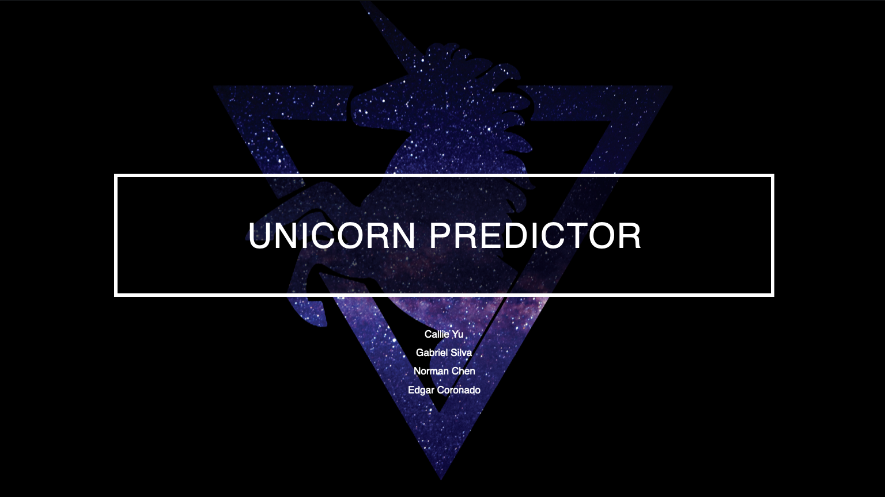

# Startup Success Predictor

---

## Technologies

For this project, we leveraged the following AWS services.

AWS Billing

Amazon Simple Storage Service (Amazon S3)

Amazon Lex

Amazon Lambda

AWS Identity and Access Management (IAM)

---

## Usage

The following tasks are required to complete:

---

## Final Outcome

- A Python script with the final Lambda function.

- A short video that demos the Startup Success Predictor in action from the “Test bot” pane. 

### Predictor with Lambda Function and Error Testing

---

## Contributors

Brought to you by Edgar Coronado, Norman Chen, Callie Yu, Gabriel Silva

---