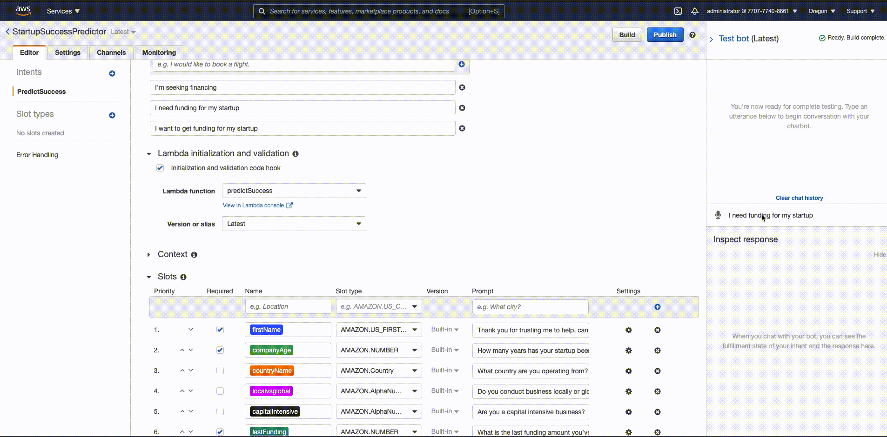

# Unicorn Predictor

Predicting the next unicorn is not an easy task, especially with so many early-stage tech companies in the market. As a lender or an investor, you want to ensure your money is being allocated effectively in companies that will generate the highest rate of return.  As a founder, you want to obtain financing throughout the startup lifecycle of your company in order to scale withouth further diluting your ownership. How do you create a product that meets the needs of both sides of the deal? Before Unicorn Predictor existed, you couldn't! Now you can, and here's how: 

We leverage various data points and Machine Learning models to support  tech startups with access to capital without diluting their ownership, personally guaranteeing, or spending hours on countless paperwork. 
We’re not a venture capital firm, we’re not a bank, we’re Unicorn Predictor. Our mission is to allow our founders to create, innovate, and succeed in their quest to change the world that we live in. 

---

## Technologies

For this project, we leveraged the following AWS services: 

- AWS Billing

- Amazon Simple Storage Service (Amazon S3)

- Amazon Lex

- Amazon Lambda

- AWS Identity and Access Management (IAM)

---

## Usage

The following parameters are passed to the Machine Learning Models in order to determine the success factor of a company: 

The following Machine Learning Models were used in order to determine the best performing model for this dataset:

1) Random Forest Classifier

2) Classification Tree

3) Adaboost

4) Gaussian Process Classifier

5) Stochastic Gradient Descent

---

## Final Outcome

- Our analysis with the best performing machine learning model: 

In conclusion, the ADABOOST Model slightly outperforms the rest of the models, and is therefore our most effective model. 

- A Python script with the final Lambda function.

- A short video that demos the Startup Success Predictor in action from the “Test bot” pane. 

### Predictor with Lambda Function and Error Testing

---

## Contributors

Brought to you by Edgar Coronado, Norman Chen, Callie Yu, Gabriel Silva

---